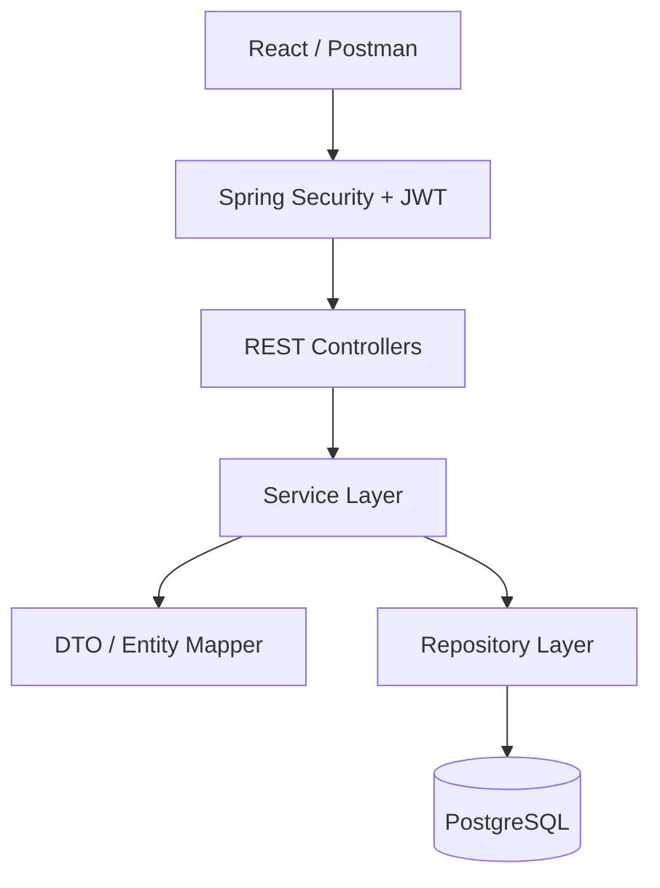
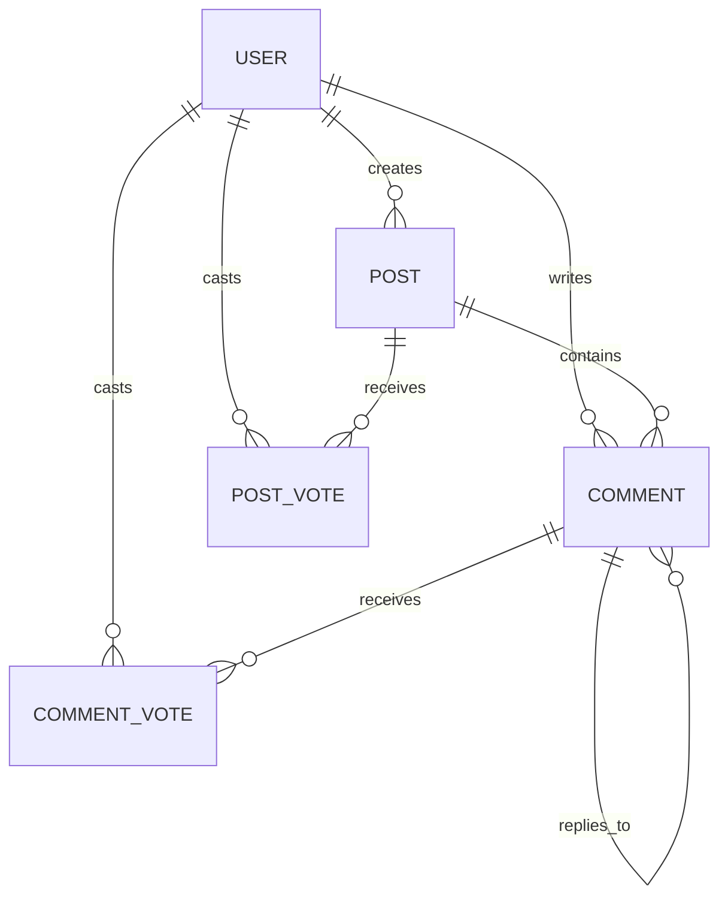

# DevConnect


A developer community platform where users can share knowledge, ask questions, and collaborate through posts and discussions.

## Project Status

✅ Backend MVP Completed

🚧 Frontend and cloud deployment are currently under development.

## About the Project

DevConnect is a backend application inspired by developer communities like Stack Overflow and Reddit. It provides secure REST APIs for user authentication, creating posts, managing discussions through nested comments, and community-driven voting. 
The application follows a layered architecture consisting of Controller, Service, Repository, DTO, Mapper, and Entity layers to promote maintainability and separation of concerns.


## Features


### Authentication
- User Registration
- Secure Login
- JWT Token Generation

### Posts
- Create Posts
- Edit Posts
- Delete Posts
- Search Posts
- Pagination
- Sorting

### Comments
- Nested Comments
- Edit Comments
- Delete Comments

### Community
- Upvote/Downvote Posts
- Upvote/Downvote Comments

### Developer Experience
- Swagger Documentation
- Request Validation (Jakarta Validation)
- Global Exception Handling


### Security
- JWT-based authentication
- Stateless session management
- Password hashing with BCrypt
- Protected endpoints using Spring Security


## Tech Stack

| Category | Technology |
|----------|------------|
| Language | Java |
| Framework | Spring Boot |
| Security | Spring Security + JWT |
| Database | PostgreSQL |
| ORM | Spring Data JPA / Hibernate |
| Build Tool | Maven |
| Documentation | Swagger (OpenAPI) |
| Validation | Jakarta Validation |
| Boilerplate Reduction | Lombok


## Architecture


## Project Structure


```
DevConnect
│
├── Backend
│   ├── config
│   ├── controller
│   ├── dto
│   ├── exception
│   ├── mapper
│   ├── model
│   ├── repository
│   ├── service
│   └── resources
│
└── README.md
```
## Prerequisites
- Java 21 or later
- Maven
- PostgreSQL
- Git

## Getting Started


Clone the repository

```bash
git clone https://github.com/Devesh-Choube/DevConnect-.git
```

Go to backend

```bash
cd DevConnect/Backend
```

Install dependencies

```bash
mvn clean install
```

Running the Application

```bash
mvn spring-boot:run
```


Create a Database 


```sql
CREATE DATABASE devconnect;
```

Spring Boot will automatically create the required tables using Hibernate on application startup.

## Environment Variables


Configure the following variables before running the project.

```properties
JWT_SECRET=your_secret

DB_URL=jdbc:postgresql://localhost:5432/devconnect

DB_USERNAME=postgres

DB_PASSWORD=password
```
## API Documentation


Once the application is running, Swagger UI is available at:

```
http://localhost:8080/swagger-ui/index.html
```

The API can be explored and tested interactively through the Swagger UI.
## Authentication

1. Register a new account using `/auth/register`.
2. Authenticate using `/auth/login`.
3. Copy the JWT token from the response.
4. Open Swagger UI.
5. Click **Authorize**.
6. Enter:

```text
Bearer <your-token>
```

7. Click **Authorize** again.
8. You can now access all protected endpoints.
## Database Design



## API Reference


### Authentication

| Method | Endpoint | Description |
|--------|----------|-------------|
| POST | `/auth/register` | Register a new user |
| POST | `/auth/login` | Authenticate user and receive JWT |

### Posts

| Method | Endpoint | Description |
|--------|----------|-------------|
| GET | `/posts?page=0&size=10&sortBy=createdAt&direction=DESC` | Retrieve paginated posts |
| GET | `/posts/{postId}` | Retrieve a post by ID |
| POST | `/posts` | Create a new post |
| PUT | `/posts/{postId}` | Update a post |
| DELETE | `/posts/{postId}` | Delete a post |
| PUT | `/posts/{postId}/vote` | Vote on a post |
| GET | `/posts/search?keyword=spring` | Search posts |

### Comments

| Method | Endpoint | Description |
|--------|----------|-------------|
| GET | `/posts/{postId}/comments?page=0&size=10` | Retrieve paginated comments for a post |
| GET | `/posts/{postId}/comments/{commentId}` | Retrieve a comment |
| POST | `/posts/{postId}/comments` | Add a comment |
| PUT | `/posts/{postId}/comments/{commentId}` | Update a comment |
| DELETE | `/posts/{postId}/comments/{commentId}` | Delete a comment |
| PUT | `/posts/{postId}/comments/{commentId}/vote` | Vote on a comment |
## Roadmap


- [x] JWT Authentication
- [x] CRUD Posts
- [x] Nested Comments
- [x] Voting System
- [x] Swagger Documentation
- [ ] User Profiles
- [ ] Image Upload
- [ ] Docker
- [ ] AWS Deployment
- [ ] CI/CD
## License

This project is licensed under the MIT License.
## Author

**Devesh Choube**

- GitHub: [@Devesh-Choube](https://github.com/Devesh-Choube)
- LinkedIn: [Devesh Choube](https://www.linkedin.com/in/devesh-choube/)